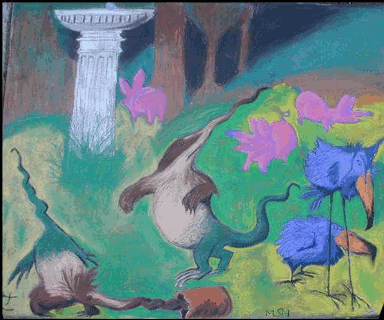

# x16-svga
X16 demo for a 384x320 256-color bitmap with black border

# Run Demo
In bash (use Git bash shell if on Windows):

<pre>$ ./run_basic_demo.sh brillig.data</pre>

"'Twas Brillig" by Matt Heffernan, 2006 
Pastel on concrete, inspired by Sir John Tenniel (1820-1914)
